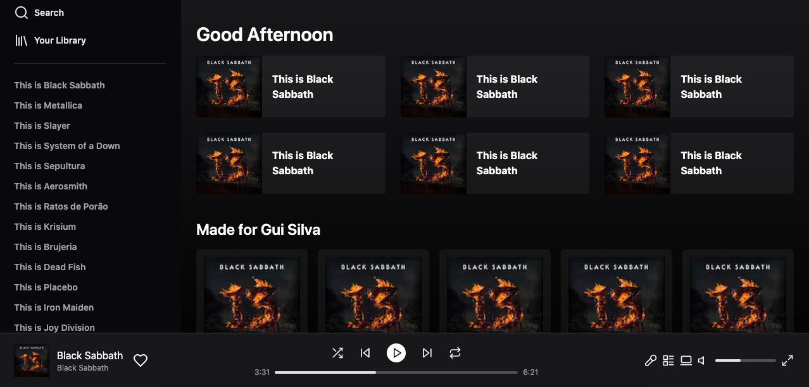

# Spotify UI Clone

<p>
Clone da UI do Spotify, feito para estudo usnado ReactJS e Tailwindcss
</p>

# Screens

<p align="center">
  
</p>

## Technologies used

- [ReactJS](https://pt-br.reactjs.org)
- [NextJS](https://nextjs.org)
- [Typescript](https://www.typescriptlang.org)
- [Tailwindcss](https://tailwindcss.com)

## Requirements

You need to install [Node.js](https://nodejs.org)

## How to use it

```bash
# Run the web server
$ npm run dev
```

The app will be available for access on your browser at (http://localhost:3000)